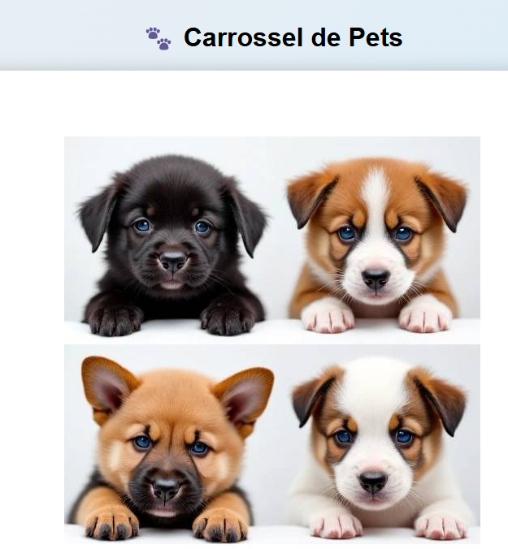

# 🐶 Carrossel de Pets Vue 3

<div align="center">
  
  
  [](https://vuejs.org/)
  [](LICENSE)
</div>

---

## 📌 Índice
- [Recursos](#-recursos)
- [Instalação](#-instalação)
- [Uso Básico](#-uso-básico)
- [Personalização](#-personalização)
- [API](#-api)
- [Limitações](#-limitações)
- [Contribuição](#-contribuição)
- [Licença](#-licença)

---

## ✨ Recursos
| Funcionalidade          | Descrição                                                                 |
|-------------------------|---------------------------------------------------------------------------|
| **Upload de Imagens**   | Suporte a JPEG, PNG, WebP (até 15MB por arquivo)                         |
| **Controles Intuitivos**| Navegação por botões/indicadores                                         |
| **Persistência**        | Salva automaticamente no `localStorage`                                  |
| **Otimização**          | Compressão automática (800x600px, 70% qualidade)                         |
| **Responsivo**          | Adaptável a desktop, tablet e mobile                                     |

---

## 🚀 Instalação
```bash
# Via npm
npm install carrossel-pets-vue

# Via yarn
yarn add carrossel-pets-vue

💻 Uso Básico
vue
<template>
  <CarrosselPets />
</template>

<script setup>
import CarrosselPets from 'carrossel-pets-vue'
</script>

🎨 Personalização
Props Disponíveis
javascript
{
  maxImages: Number,   // Default: 15
  showControls: Boolean // Default: true
}

Estilos
css
:root {
  --carrossel-primary: #4a6fa5;
  --carrossel-border-radius: 12px;


⚠️ Limitações
Máximo de 15 imagens simultâneas

Não suporta vídeos ou GIFs animados

Depende do localStorage do navegador


🤝 Contribuição
Faça um fork do projeto

Crie uma branch: git checkout -b minha-feature

Commit suas mudanças: git commit -m 'feat: Minha nova feature'

Push para a branch: git push origin minha-feature

Abra um Pull Request

📜 Licença
Distribuído sob a licença MIT. Veja o arquivo LICENSE para mais detalhes.

<div align="center"> <sub>Desenvolvido com ❤️ por <a href="https://github.com/Tatianakami">Tatiana Kami</a></sub> </div> ```